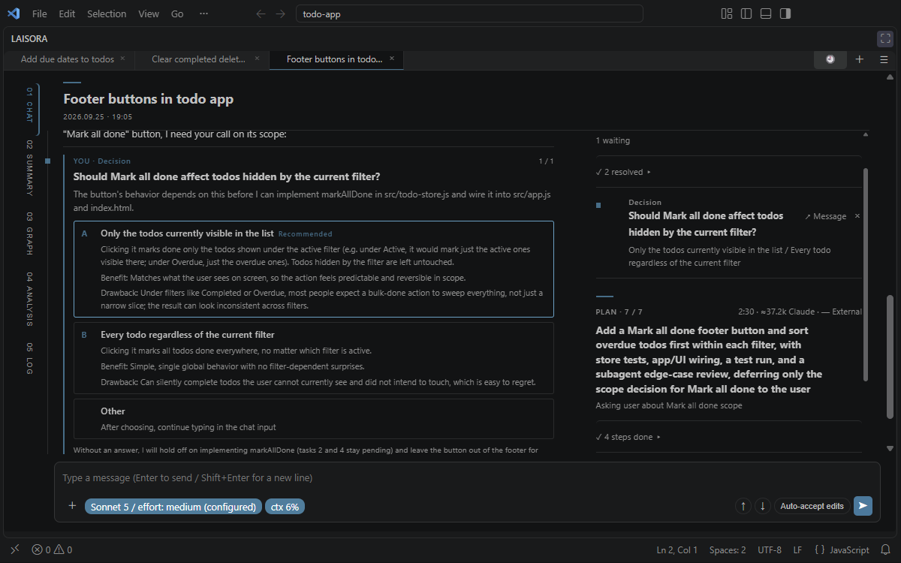
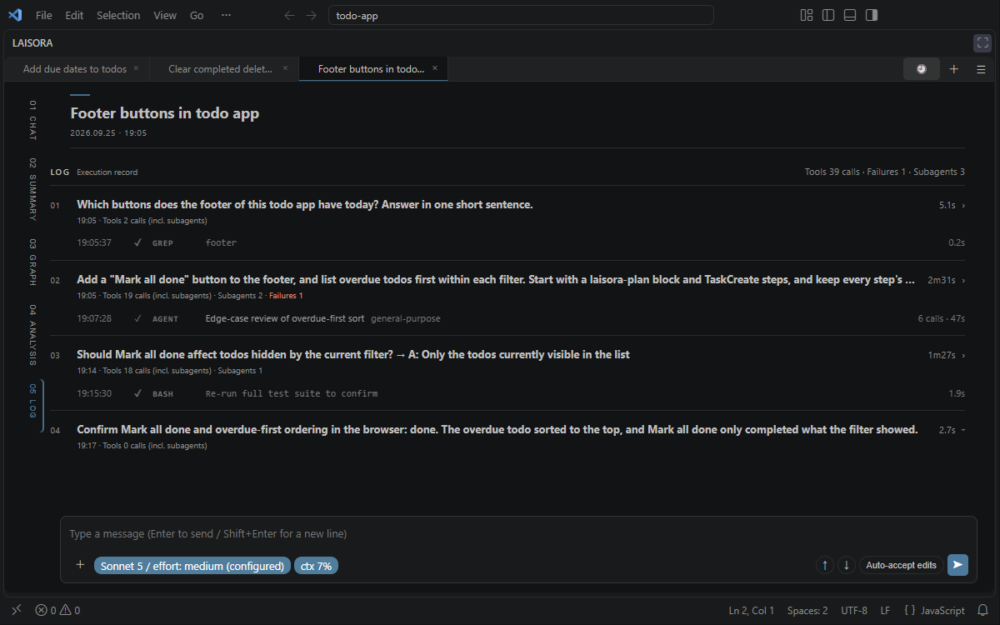
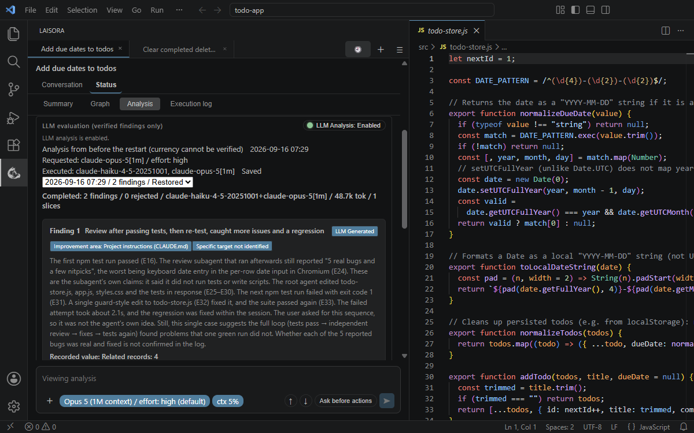
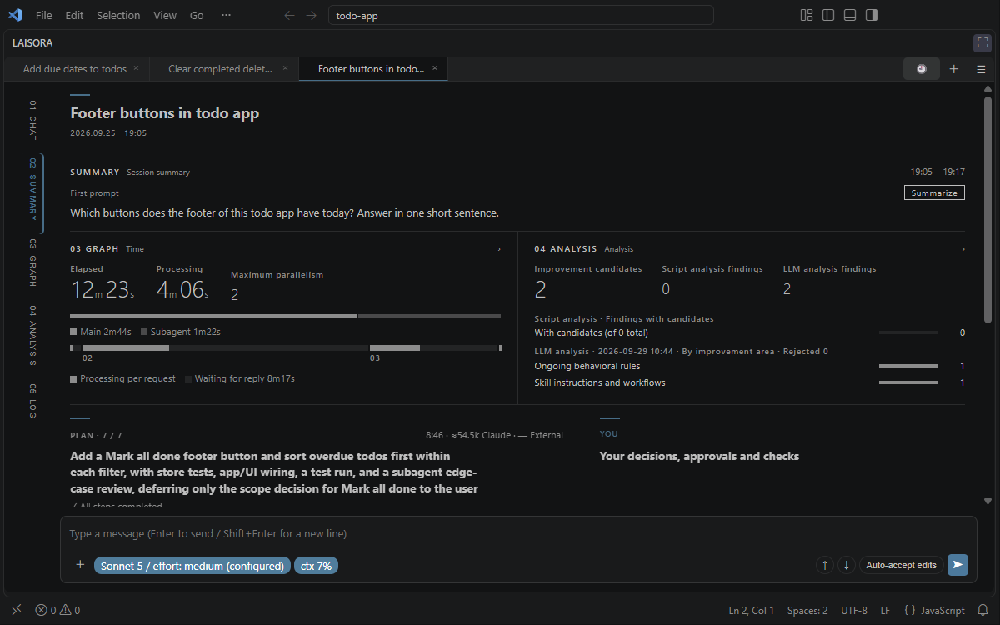
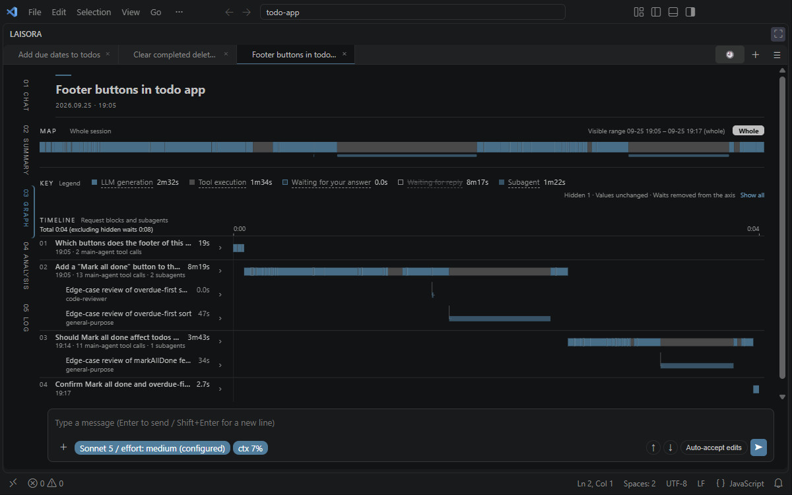
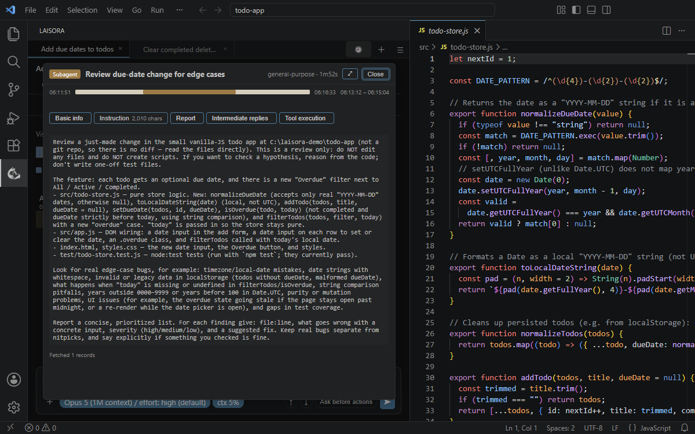

English | [日本語](README.ja.md)

An AI agent runs command after command and rewrites code. Watching the log does not necessarily tell you what it is doing or why. I have found myself in that position more and more often.

I wanted the everyday view to focus on the conversation: what I want to achieve and how to move forward. When I need the details, I can ask the agent to explain or open the execution log. LAISORA is a VS Code extension built around that way of working.

Commands and file operations appear in LOG, making your instructions and the agent's replies easier to follow in CHAT. The two screenshots below are the same conversation: first CHAT with PLAN and YOU beside the conversation, then LOG, where each of your requests is a numbered group of the tool calls it led to.

## Turn work logs into improvements for the next task

The finished result does not always reveal where the agent struggled or repeated itself along the way. Reading through a long log yourself is not easy either.

LAISORA uses an LLM to analyze work logs and suggest improvements to the workflow, instructions, and settings. Follow a suggestion back to the records behind it, then start a new conversation to act on the improvements you agree with.

**Bring advances in LLMs into everyday use.**

Analysis uses the model selected for the conversation, so the capabilities of newer models can also support reviewing the work and suggesting improvements.

## What you can do

### Run several conversations side by side

Each conversation is a tab (20 by default; `laisora.tabLimit`). Tabs keep their own draft, view selection, and scroll position, and a tab stays lit while its subagents or background commands are still running, even after the main reply has finished. Open past sessions from the history list and resume them in the folder where the conversation was started, even if commands changed directory along the way. By default, LAISORA reopens the tabs that were open when the window was last closed or reloaded; turn off `laisora.restoreTabsOnStartup` to start with a single new tab (also available on the LAISORA settings page, which you open from **Settings** in the ☰ menu of a conversation or with **LAISORA: Open Settings**).

### Read the reply without the noise

Every conversation has one vertical navigation with five views: **CHAT**, **SUMMARY**, **GRAPH**, **ANALYSIS**, and **LOG**. The composer stays available in every view.

CHAT shows what the model says to you, along with approval requests, failures, and relevant system notices. Tool activity — commands, file reads and edits, searches, and subagents — goes to LOG, so a long run of commands does not break a reply into pieces. Replies stay steady as they stream. Each reply has a footer with a copy button and its time; older footers appear on hover or keyboard focus. You can copy your own messages too.

### See what the agent is actually doing

**PLAN** beside CHAT shows the goal the agent declared, its steps and their status, who is working on each, elapsed time, and tokens. It stays for the whole goal, across messages, and completed steps fold into one counted line that you can expand. Without declared steps, it shows the work observed under NOW. In a narrow window, a one-line bar under the title opens PLAN and YOU as a drawer.

The other views let you look more closely:

- **SUMMARY** — at the top, the key figures from GRAPH (elapsed and processing time, parallelism, time per request) and ANALYSIS (improvement candidates by area). Below, PLAN on the left and YOU on the right, and earlier requests with their step count, time, and tokens. With the agent roster enabled, it also lists the observed agents with their applied model and effort. In a narrow window, YOU comes first in a single column.
- **GRAPH** — a timeline of the main agent, its subagents, and background tasks on an elapsed-time axis, with each request as a block and a zoomable time window. Long waits can be hidden from the axis. Open a subagent to read the full instruction it was given.
- **ANALYSIS** — at the top, TIME (the main agent's time by model and in tools), ROLES (time and tokens by delegated role; open a row for its runs) and ERR (failures out of all tool calls, by kind). Below, script analysis lists failure classifications and convention violations linked to LOG, and optional LLM analysis shows findings as numbered articles that link back to their evidence. Analyzing a past session opened from the history list also compares it with your own past sessions.
- **LOG** — tool calls grouped by request, with the available input and output previews, duration, and marks for failures and convention violations. Only the latest request is open; a folded request still shows its last tool call.

Some information may be unavailable when session records are incomplete; the views say so instead of showing partial numbers as complete.

The screenshots below show SUMMARY, GRAPH, and the instruction given to a subagent opened from GRAPH.

### Stay in control while it runs

**YOU** collects approvals, decisions, and checks on your machine, each linking back to where it was asked in CHAT. Resolved items fold into one counted line, and a decision or check you no longer need can be dismissed with ×. Decisions in replies appear as cards with options, pros and cons, a recommendation, and the default if you do not answer. By default, LAISORA asks Claude to maintain plans and present decisions and checks this way (`laisora.claude.planInstruction`; applies to conversations started or resumed afterwards).

Approve or deny tool requests in CHAT. Send additional instructions during a turn, interrupt, search within the conversation (Ctrl+F), and choose the model, reasoning effort, and permission mode beside the message box. The model chip shows the effort the CLI actually applies. Enter sends and Shift+Enter inserts a new line; swap them with `laisora.composer.sendKey` or on the LAISORA settings page.

### Choose who the agent can delegate to

The agent roster on the LAISORA settings page lets you configure worker, explorer, and reviewer roles, with model and effort per row (`laisora.orchestration.enabled`, `laisora.orchestration.agents`). Codex and Antigravity are optional external executors when their CLIs are installed. Roster changes apply from the next session.

### Keep lessons for later work

The learning ledger is off by default (`laisora.learning.enabled`). When enabled, the main agent can record model-specific or general lessons, and active rules are passed to later sessions. Records stay on your machine; text containing absolute paths or credentials is refused. Learning works with or without the agent roster, and setting changes apply from the next session.

### Carry long work forward

Hand off a conversation to a new session using a summary and captured user messages, while preserving the original. The continuation starts with its summary card and carries recorded decisions forward. You can also export a conversation to Markdown.

Follow Markdown file links to a location in the editor. Within the workspace or conversation folder, Office documents, PDFs, and other file types you choose open in their default app (`laisora.fileLinks.openWithSystemApp`); folder links open in the file manager. For files opened in VS Code, links from the LAISORA editor tab also select the file in Explorer (`laisora.fileLinks.revealInExplorer`); links from the side bar keep the conversation visible. By default Claude is asked to write local files as links (`laisora.claude.fileLinkInstruction`; applies to conversations started or resumed afterwards).

To open files outside the workspace and conversation folder, enable `laisora.fileLinks.allowOutsideWorkspace` in user settings. These files open after confirmation and in a read-only editor unless you turn off `laisora.fileLinks.confirmOutsideWorkspace` or `laisora.fileLinks.openOutsideReadOnly`. Network shares (UNC paths) and device paths are always refused. File-link settings are also on the LAISORA settings page.

## Supported SDKs

| SDK | Status |
| --- | --- |
| Claude Agent SDK | Supported through a local Claude Code installation. |
| Codex SDK | Planned. Not available in the current version. |

Optional Codex delegation through its CLI is available in the agent roster; it does not provide Codex SDK conversations.

## Requirements

- VS Code 1.90 or later, running in a local, trusted window.

Windows is the tested platform. macOS and Linux have not been verified. WSL, Remote SSH, Dev Containers, and virtual workspaces are not supported.

## Install and open

Install the supplied `.vsix` file using **Extensions: Install from VSIX…** in the VS Code command palette, then reload the window. Open LAISORA from the activity bar or run **LAISORA: Open** from the command palette.

The main interface supports English and Japanese; some diagnostic messages remain in Japanese. The README language links above let you choose the documentation language.

## LAISORA settings

The send shortcut, tab restore, API key handling, file links, agent roster, and learning switch are on the LAISORA settings page (**Settings** in the ☰ menu of a conversation, or **LAISORA: Open Settings**). For other settings, such as the tab limit, default working directory, and work-log analysis, search for `laisora.*` in VS Code Settings. Extension preferences and UI state are saved in VS Code.

## SDK-specific setup and behavior

### Claude Agent SDK

#### Setup and authentication

- Claude Code installed and signed in with your own account. By default LAISORA passes the environment through: if `ANTHROPIC_API_KEY` is set, Claude Code uses it and usage is billed to the API rather than your subscription, and LAISORA posts a notice in the conversation; set `laisora.claude.apiKeyPolicy` to `subscriptionOnly` (user setting, also switchable on the LAISORA settings page) to remove the key from the launched child process and use the signed-in subscription. Other inherited Claude Code or Anthropic environment variables and settings can affect authentication and the endpoint.
- Node.js if your Claude Code installation uses a JavaScript entry point. It is not required by the extension when it resolves a native Claude executable.

If Claude Code cannot be found, set `laisora.claude.executablePath` in your user settings to the executable or JavaScript entry point. This setting cannot be supplied by a workspace.

#### Settings and permissions

Choose a model and effort level beside the composer in any view. Model selections are saved in the shared `~/.claude/settings.json` and affect subsequent Claude Code sessions. Effort is saved per supported model, including 1M-context variants such as Opus 1M, so new sessions start with it; `max` and selections without a known settings key remain session-only.

The model chip shows the applied effort, following Claude Code's setting precedence and model capabilities; the details distinguish runtime-reported, requested, and configured values.

Permission mode changes in LAISORA do not rewrite Claude Code's shared default permission mode. The extension saves the selected mode except for `bypassPermissions`, which is not saved for future sessions. Choosing that mode allows file edits and commands without the usual permission prompts.

#### Long conversations and intervention

Start a manual handoff when the conversation is idle. LAISORA preserves the original session and opens a continuation using a summary and user messages captured since the previous handoff. Older context is carried through existing summaries and handoff records. Handoff uses model capacity. A summary can omit or misinterpret details, so check important requirements when continuing.

You can send an additional instruction while a turn is running. Delivery depends on the Claude Code execution boundary; it does not guarantee an immediate change in behavior.

#### History, data transmission, and model use

LAISORA reads Claude Code's local session records to show history and work logs, and saves extension state and analysis results locally. Analysis results are stored as one local file per run in LAISORA's VS Code extension storage and can include generated findings and evidence labels. Chat, LLM analysis, summaries, and handoff send the content needed for the operation through Claude Code and use your account's available capacity. Displaying work-log statistics does not invoke an LLM.

LLM findings are model interpretations. Passing citation and numeric checks does not establish that the overall judgment is correct. You can inspect the evidence behind a finding.

Your Claude Code settings, hooks, and configured tools can affect execution and external connections. Review them as you would when using Claude Code directly. Logs and saved diagnostics can contain conversation content; review them before sharing.

#### Troubleshooting

- **Cannot start a conversation:** run `claude` in a terminal and check that it starts and is signed in. Then inspect **View → Output → LAISORA** for details.
- **No working directory:** open a folder or set `laisora.defaultCwd`. Resuming a session uses the folder where it was started; moving a project may require restoring that path or starting a new conversation.
- **Usage limit or analysis failure:** check the reported error and your Claude account availability. A failed analysis is not a clean bill of health for the session.
- **An instruction did not take effect immediately:** inspect the continuing conversation before resending it. Delivery and the model's response are separate steps.

## How LAISORA came about

LAISORA itself is developed through conversations with Claude Code, Codex, and Antigravity. It grew out of a challenge I encountered during development: being unable to keep up with the AI's work logs.

## License

[MIT](LICENSE).
